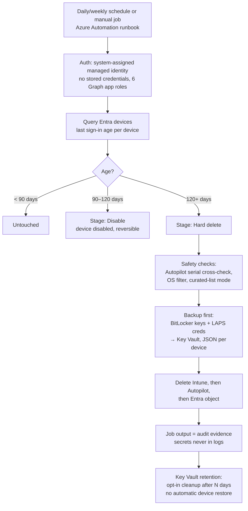

# Device Cleanup Automation

Reusable Azure Automation deployment of Matt Kohut's two-stage stale-device cleanup
(Entra disable at 90 days → hard delete at 120 days, with Intune managedDevice + Autopilot
record cleanup and BitLocker/LAPS backup). Terraform-provisioned, managed-identity
authenticated, multi-customer via tfvars.

Customer-specific configuration (`terraform/deployments/*.tfvars`) is gitignored and
stays local — copy `deployments/example.tfvars` to start a new environment. Nothing
tenant-identifying belongs in tracked files.
Alerting: `docs/2026-08-11-alerting-request.md` — phase 1 (email) shipped; Teams /
SharePoint / webhook phases add receivers to the same action group.

## Flow 


## Layout

- `source/` — Matt's original scripts, preserved for reference (credential values
  sanitized to blanks):
  - `Invoke-EntraIdStaleDeviceCleanup-Unified.ps1` — the authoritative, complete
    version: one script, three auth modes (AppRegistration / Delegated / ManagedIdentity).
  - `Invoke-EntraIdStaleDeviceCleanup-ManagedIdentity.ps1` — earlier MI-only variant
    (no Intune/Autopilot deletion, blob-storage output).
  - `Div-CleanupEntra-Intune-AP-Devices.ps1` — delegated variant the runbook was
    ported from. Truncated at line 1090 in the original source itself (verified
    against the author's own copy); the Unified script contains the full tail.
- `runbook/Invoke-StaleDeviceCleanup.ps1` — the Automation port. Original configuration
  options remain runbook parameters, with additional live safety requirements described below:
  selectable authentication (managed identity by default), job-stream output, Key Vault secret backup with retention cleanup,
  and `-DeviceListBlobUrl` (blob CSV, same columns/semantics) replacing the local `-DeviceListCsv`.
- `terraform/modules/device-cleanup/` — the reusable module.
- `terraform/deployments/*.tfvars` — one file per customer/environment. New customer = new tfvars.

## Running locally: interactive user or app registration

The maintained `runbook/Invoke-StaleDeviceCleanup.ps1` supports
`-AuthMode ManagedIdentity` (default), `Delegated`, or `AppRegistration`.
Existing Automation schedules continue to use managed identity. Use PowerShell 7.2+
for local runs. The script checks for the required modules and automatically installs
missing ones from PSGallery in `CurrentUser` scope before importing them. Existing
modules are reused. Graph submodules are aligned to one release: the version already
loaded in the session, or the highest installed Authentication version in a fresh
session. Missing matching submodules are installed automatically. This requires
internet access and PowerShellGet; no administrator
rights are needed for the installation. To preinstall the dependencies manually:

```powershell
Install-Module Microsoft.Graph.Authentication, Microsoft.Graph.Identity.DirectoryManagement, Microsoft.Graph.Identity.SignIns, Az.Accounts -Scope CurrentUser
```

If Graph reports "Assembly with same name is already loaded" or
`SessionNotInitialized` after an import error, start a fresh `pwsh -NoProfile`
process and rerun the downloaded script there. Installing another version or
calling `Remove-Module` does not unload DLLs already loaded in the process.
The script stops before sign-in if module initialization reports errors.

Interactive user, Windows-only preview (no Key Vault required for this example):

```powershell
./runbook/Invoke-StaleDeviceCleanup.ps1 -AuthMode Delegated `
    -TenantId '<tenant-id>' -OperatingSystemFilter Windows -BackupBLandLAPs $false
```

Add `-UseDeviceAuthentication` for device-code sign-in. An optional `-ClientId`
selects your own public-client app for Graph delegated login; Azure data-plane
login uses Azure PowerShell. Interactive mode is intended for a local console,
not an unattended Automation schedule.

App registration with a certificate installed with its private key in the local
certificate store accessible to the running user:

```powershell
./runbook/Invoke-StaleDeviceCleanup.ps1 -AuthMode AppRegistration `
    -TenantId '<tenant-id>' -ClientId '<application-id>' `
    -CertificateThumbprint '<certificate-thumbprint>' `
    -OperatingSystemFilter Windows -KeyVaultName '<vault-name>'
```

Or supply a client secret as a SecureString (do not put secrets in command lines,
source, tfvars, or ordinary Automation job parameters):

```powershell
$secret = Read-Host 'App registration client secret' -AsSecureString
./runbook/Invoke-StaleDeviceCleanup.ps1 -AuthMode AppRegistration `
    -TenantId '<tenant-id>' -ClientId '<application-id>' -ClientSecret $secret `
    -OperatingSystemFilter Windows -KeyVaultName '<vault-name>'
```

These examples retain `DryRun=true`. Live runs still require all existing
[purge safety](docs/purge-safety.md) gates, including a vault and an explicitly
approved device cohort. The reference scripts in `source/` remain unchanged.

Permissions must be provisioned separately. App registrations need the six Graph
**application** permissions listed in the runbook header, with admin consent.
Interactive users request the corresponding **delegated** scopes and also need
roles authorizing the requested device, Intune, BitLocker, and LAPS operations;
a regular unprivileged account cannot perform administrative cleanup merely by
signing in. See Microsoft's [Graph authentication guidance](https://learn.microsoft.com/en-us/powershell/microsoftgraph/authentication-commands).

When backups, retention cleanup, or a blob list are enabled, the selected user or
service principal also needs Azure data-plane access: `Key Vault Secrets Officer`
on the backup vault and `Storage Blob Data Reader` for the input blob as applicable.
Delegated mode can prompt twice (Graph and Azure); select the same user for both.
`Az.Accounts` is only required for these data-plane operations in non-managed-identity
modes. Authentication targets Azure public cloud. See [Azure sign-in](https://learn.microsoft.com/en-us/powershell/module/az.accounts/connect-azaccount)
and [resource tokens](https://learn.microsoft.com/en-us/powershell/module/az.accounts/get-azaccesstoken).

Offline validation: `pwsh -NoProfile -File tests/Test-Authentication.ps1` and
`pwsh -NoProfile -File tests/Test-PurgeSafety.ps1`. These verify authentication
routing and safety behavior with mocks; they do not prove tenant consent or RBAC.

## What Terraform creates (per environment)

- Automation account (`aa-devicecleanup-<env>-<location>-1` by default) with a
  **system-assigned managed identity**, PowerShell 7.2 runbook, and the pinned
  Microsoft.Graph modules (Authentication, Identity.DirectoryManagement, Identity.SignIns).
- Six Graph **application** role grants to the identity (same list as the original script's
  delegated scopes).
- Key Vault (RBAC, purge protection off) + `Key Vault Secrets Officer` for the identity —
  the runbook stores one JSON secret per hard-deleted device (BitLocker keys + LAPS creds),
  `RunVaultRetentionCleanup=true` opts into deleting/purging expired backups.
  Retention tags alone do not expire secrets. Live mode requires backup_enabled=true.
- Optional daily or weekly schedule (`schedule_frequency = "Day"` or `"Week"`). `enable_apply = false` (the default) keeps every scheduled run
  in DryRun. Live mode also requires a Windows filter, explicit object IDs and safety parameters.
  Prefer manual bounded live batches while the recurring schedule stays in DryRun.
- Optional job alerting (`alerting_enabled = true`, default off): automation job diagnostics
  → Log Analytics (module-created, or bring your own via `log_analytics_workspace_id`) →
  scheduled query alert on Failed/Suspended/Stopped jobs (15-min cadence, auto-mitigating)
  → action group emailing `alert_email_addresses`. Later phases (Teams / SharePoint /
  generic webhook) add receivers to the same action group — see
  `docs/2026-08-11-alerting-request.md`. Note: manual portal/CLI job starts bypass
  Terraform's parameter injection, so a bare start fails the KeyVaultName validation —
  which is also a handy way to test the alert.

## Deploying

Deployer needs: **Contributor** + **User Access Administrator** (or Owner) on the target RG,
and a privileged directory role (Global Administrator / Privileged Role Administrator) for
the Graph app-role grants. A read-only app registration cannot deploy this.

Run the pre-flight check first — it verifies the az session/tenant, required
resource providers (feature-aware: ACS/Logic only when `pretty_email_enabled`,
Insights/Log Analytics only when `alerting_enabled`), the resource group, deployer
RBAC (Owner, or Contributor + User Access Administrator), the directory role for
the Graph app-role grants (GA/PRA), and terraform. `-Register` auto-registers
missing providers:

```bash
az login --tenant <customer-tenant>
pwsh scripts/Test-DeploymentPrereqs.ps1 -TfvarsPath terraform/deployments/<customer>-dev.tfvars -Register
cd terraform
terraform init
terraform plan  -var-file=deployments/<customer>-dev.tfvars
terraform apply -var-file=deployments/<customer>-dev.tfvars
```

Prod is the same with the prod tfvars (check `schedule_start_time` is still in the
future). All environments share local state — use one `terraform workspace` per
tfvars file if you apply more than one from this directory.

## Validation flow (per customer)

1. Dev apply → start a manual job in the portal (defaults are DryRun).
2. Diff the DRY-RUN would-DELETE/DISABLE list against the customer's existing
   stale/non-compliant device inventory.
3. Prod apply → let the scheduled DryRun produce output for customer sign-off.
4. Run a bounded manual live job against the approved exact object-ID cohort; keep recurring jobs in DryRun. See [purge safety](docs/purge-safety.md).

## Notes for reuse

- All original script knobs not surfaced as first-class variables can be set per-customer via
  `extra_runbook_parameters` (lowercase keys, JSON-literal booleans), e.g.
  `{ disableonly = "true" }` for a customer that never wants hard deletes.
- Curated-list runs: upload a CSV (`DisplayName`/`DeviceId` columns) to a blob the identity
  can read (grant `Storage Blob Data Reader`) and start a job with `devicelistbloburl`.
- Operating-system filtering: pass `OperatingSystemFilter=Windows` for a Windows-only run.
  The filter is applied after age-based or curated-list resolution and before classification.
  For a live Windows-only run, also set `DisableOnly=true` for the first pass unless deletion
  has separately been approved; this filters non-Windows candidates out before any action logic.
  Supported values are `Windows`, `Android`, `AndroidForWork`, `AndroidAOSP`, `iOS`, `IPhone`,
  `IPad`, `macOS`, `Linux`, `Unknown`, and `Other`. Empty is the backward-compatible all-OS default.
- Scheduled Terraform jobs can pass the filter through `extra_runbook_parameters`, for example:
  `{ operatingsystemfilter = "Windows" }`. Always run a fresh DryRun before a live run.
- The runbook never writes secret material to job output — Key Vault only.
- Provider quirk: the Automation API echoes `runbook_type` back as "PowerShell", so azurerm
  plans a runbook replace on already-deployed environments. Harmless (same content re-uploaded,
  schedules relink), but expect `1 to destroy` on the next apply of an existing deployment.

## Hybrid-joined devices: `HybridDeviceHandling`

**Cloud-side disable can be reverted on hybrid-joined devices.** Entra Connect
re-syncs `accountEnabled` from the on-prem computer account for hybrid (`ServerAd`) devices. A cloud-side delete of
a synced object is likewise expected to be recreated while the AD computer account remains in
sync scope. The durable path for hybrid devices is on-premises: act in AD (see
`scripts/Invoke-StaleHybridAdCleanup.ps1`), let sync propagate to Entra, and let the Intune
device cleanup rule age out the Intune record.

The runbook parameter `HybridDeviceHandling` selects the behavior per customer:

| Value | Behavior | When to use |
|---|---|---|
| `Process` (default) | Attempt cloud-side disable/delete on hybrid devices anyway | Customers who want the cloud attempt made regardless — for example where AD cleanup is handled by another team on its own cadence, or where sync scope is being reduced and the revert window is acceptable |
| `ReportOnly` | Classify stale `ServerAd` devices as `OnPremRemediationRequired`, take no cloud action, count them in the run summary, and emit them in the CSV rows as input for the AD-side script | Customers who own their AD and want honest run reports with a work-list for the on-prem pass |

Scheduled runs set it through Terraform: `extra_runbook_parameters = { hybriddevicehandling = "ReportOnly" }`
(lowercase key, per the extra-parameters convention). Manual portal starts type it like any other
field. The default is `Process` so existing deployments keep their current behavior until a
customer explicitly opts in.

## Purge safety and daily previews

See [purge safety](docs/purge-safety.md) for required live parameters, activity holds, configurable asset exclusions, backup read-back and failure handling. Run offline validation with `pwsh -NoProfile -File tests/Test-PurgeSafety.ps1`. Existing hybrid `ReportOnly`, CSVROW/RUNSUMMARY output and disable-before-delete defaults are preserved.
